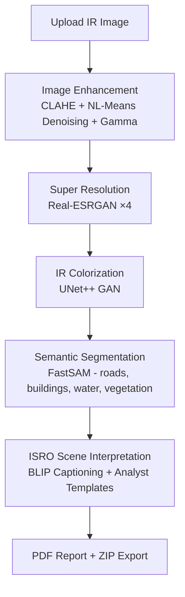
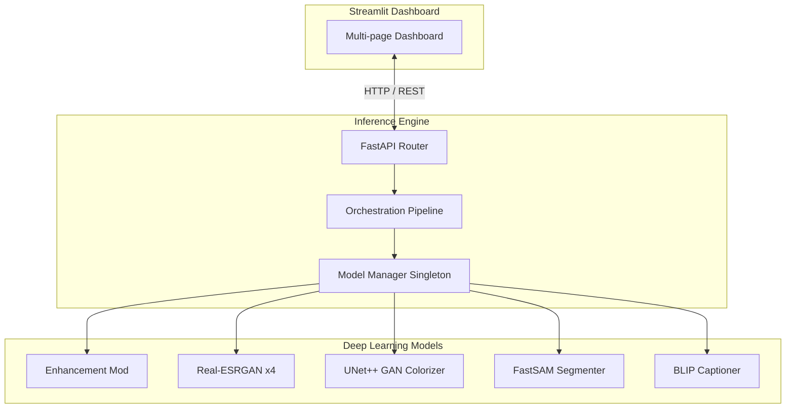

# 🛰️ IRIS-AI: Intelligent Remote-sensing Infrared Interpretation Suite

### *ISRO Bharatiya Antariksh Hackathon 2026 · Problem Statement PS-10*

---

[](https://python.org)
[](https://pytorch.org)
[](https://streamlit.io)
[](LICENSE)
[](CONTRIBUTING.md)
[](https://github.com/vssanjay-11/ISRO-BAH-IRIS)

IRIS-AI is a production-quality, end-to-end computer vision and image enhancement application tailored for satellite and aerial infrared imagery. Built for the ISRO Bharatiya Antariksh Hackathon 2026, it translates raw, low-resolution infrared images into high-resolution, colorized, and semantically annotated outputs.

---

## 📖 Motivation & Problem Statement

Infrared (IR) sensors are critical for remote sensing, search-and-rescue, and surveillance operations because they can capture features in complete darkness or through atmospheric haze. However, IR images suffer from low spatial resolution, sensor noise, lack of color context, and general difficulty in human interpretation. 

**IRIS-AI** addresses these challenges by transforming raw infrared feeds through a modular deep learning pipeline, producing colorized, high-resolution imagery along with automated semantic segmentation (roads, buildings, water, vegetation) and vision-language analyst summaries.

---

## 🛠️ Processing Pipeline & Architecture

The IRIS-AI pipeline treats the core UNet++ GAN colorizer as a **black-box inference engine**, allowing developers to extend processing steps before and after the GAN without editing the underlying neural network code.



### High-Level System Architecture



---

## 📂 Project Structure

```
IR-colorization/
├── .github/                     # Community issue & PR templates
├── assets/                      # Application logos & documentation assets
├── backend/                     # Inference pipeline modules & FastAPI server
│   ├── enhancer.py              # CLAHE, denoising, gamma scaling
│   ├── colorizer.py             # Wraps existing GAN model
│   ├── super_resolution.py      # Real-ESRGAN ×4 upscaler
│   ├── segmenter.py             # FastSAM semantic segmentation
│   ├── interpreter.py           # ISRO analyst templates generator
│   ├── pipeline_v2.py           # Orchestration pipeline
│   └── report_generator.py      # ReportLab PDF generator
├── docs/                        # Complete project documentation
├── examples/                    # Sample usage scripts
├── frontend/                    # Streamlit dashboard
├── tests/                       # Unit & integration tests
├── config.py                    # Central configurations
├── requirements.txt             # Project requirements
└── LICENSE                      # MIT License
```

---

## 🚀 Quick Start

### 1. Installation
Clone the repository:
```bash
git clone https://github.com/vssanjay-11/ISRO-BAH-IRIS.git
cd ISRO-BAH-IRIS
```

Set up virtual environment:
```bash
python -m venv .venv
source .venv/bin/activate  # On Windows: .venv\Scripts\activate
```

Install GPU support (CUDA 12.1 recommended) and dependencies:
```bash
pip install torch==2.1.2 torchvision==0.16.2 torchaudio==2.1.2 --index-url https://download.pytorch.org/whl/cu121
pip install -r requirements.txt
```

### 2. Download Weights
Use the utility script to download the pre-trained weights for the colorizer, FastSAM, and Real-ESRGAN models:
```bash
python download_weights.py
```

### 3. Launch the Application

**Run the Backend API:**
```bash
uvicorn backend.api:app --host 0.0.0.0 --port 8000
```

**Run the Frontend Dashboard:**
```bash
streamlit run frontend/app.py
```

---

## 📊 Pipeline Outputs

The pipeline produces the following outputs in your export bundle:
- `00_original.png`: Raw IR source image.
- `01_enhanced.png`: Image after contrast adjustment and denoising.
- `02_super_res.png`: ×4 upscaled image.
- `03_colorized.png`: Colorized output.
- `04_segmented.png`: Detected semantic overlay classes.
- `IRIS_AI_Report.pdf`: PDF analytical report.

---

## 🤝 Contributing & Community

Contributions are welcome! Please read our [Contributing Guidelines](CONTRIBUTING.md) and [Code of Conduct](CODE_OF_CONDUCT.md).

For security disclosures, refer to [SECURITY.md](SECURITY.md).

---

## 📜 Citation

If you use this project in your research, please cite:

```bibtex
@misc{iris_ai_2026,
  title     = {IRIS-AI: Intelligent Remote-sensing Infrared Interpretation Suite},
  author    = {IRIS-AI Contributors},
  year      = {2026},
  url       = {https://github.com/vssanjay-11/ISRO-BAH-IRIS}
}
```

---

## 📄 License

Distributed under the MIT License. See [LICENSE](LICENSE) for more details.
