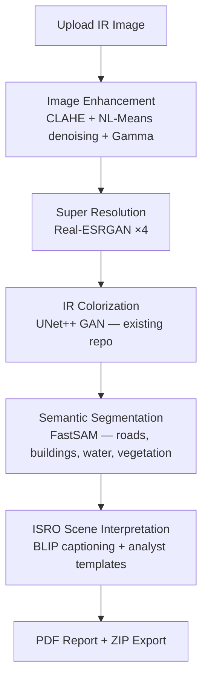

# 🛰️ IRIS-AI — Intelligent Remote-sensing Infrared Interpretation Suite
### ISRO Bharatiya Antariksh Hackathon 2026 · Problem Statement PS-10

[](https://python.org)
[](https://pytorch.org)
[](https://streamlit.io)
[](LICENSE)

---

## Overview

IRIS-AI is a **production-ready AI application** built on top of the [IR-colorization](https://github.com/chenlingqiang/IR-colorization) repository. It transforms raw infrared satellite/aerial images through a complete interpretation pipeline without modifying the original colorization model.

**Key principle**: The existing UNet++ GAN colorizer is treated as a **black box inference engine**. All new capabilities are added as modular, reusable components outside the original code.

This project has been tested using **CUDA 12.1**, **RTX 2050**, and **Python 3.10**.

---

## Processing Pipeline



---

## Project Structure

```
IR-colorization/
├── config.py                    # Central configuration (all paths/constants)
├── requirements.txt             # All dependencies
├── download_weights.py          # Auto-download all pretrained weights
├── download_datasets.py         # Dataset downloader (FLIR, LLVIP, KAIST, TNO)
│
├── models/                      # EXISTING — IR colorization GAN (unchanged)
├── data/                        # EXISTING — dataset utilities (reused for batch)
├── util/                        # EXISTING — util.py, tensor2im, save_image, mkdir
├── options/                     # EXISTING — CLI options (bypassed via Namespace)
│
├── backend/                     # NEW — all IRIS-AI inference modules
│   ├── enhancer.py              # CLAHE, denoising, gamma
│   ├── colorizer.py             # Wraps existing GAN (black box)
│   ├── super_resolution.py      # Real-ESRGAN ×4
│   ├── segmenter.py             # FastSAM semantic segmentation
│   ├── interpreter.py           # ISRO analyst paragraph
│   ├── captioner.py             # BLIP image captioning
│   ├── pipeline_v2.py           # Orchestrates full pipeline
│   ├── pipeline.py              # Original (retained for compatibility)
│   ├── batch_processor.py       # Batch/folder/recursive processing
│   ├── report_generator.py      # ReportLab PDF generation
│   └── exporter.py              # ZIP export
│
├── utils/                       # NEW — IRIS-AI utilities
│   ├── gpu_utils.py             # CUDA/MPS/CPU detection + VRAM monitoring
│   └── model_manager.py         # Singleton model lifecycle manager
│
├── configs/                     # NEW — user settings
│   ├── __init__.py
│   └── settings.py              # JSON-persisted user config
│
├── frontend/                    # NEW — Streamlit UI
│   └── app.py                   # 8-page premium dashboard
│
├── checkpoints/experiment_name/ # Colorization weights (download below)
│   └── latest_net_G.pth
│
└── weights/                     # All other model weights (auto-downloaded)
    ├── RealESRGAN_x4plus.pth
    └── FastSAM-s.pt
```

---

## Quick Start

### 1. Clone & Install

Clone Repository
```bash
git clone https://github.com/chenlingqiang/IR-colorization
cd IR-colorization
```

Create Virtual Environment
```bash
python -m venv .venv
```

Activate Environment

**Windows**
```bash
.venv\Scripts\activate
```
**Linux/macOS**
```bash
source .venv/bin/activate
```

Install GPU Version
```bash
pip install torch==2.1.2 torchvision==0.16.2 torchaudio==2.1.2 --index-url https://download.pytorch.org/whl/cu121
pip install -r requirements.txt
```

CPU Installation
```bash
pip install -r requirements.txt
```

### 2. Verify GPU Installation

```bash
python -c "import torch; print(torch.__version__); print(torch.version.cuda); print(torch.cuda.is_available()); print(torch.cuda.get_device_name(0) if torch.cuda.is_available() else 'No GPU')"
```
Expected output:
```
2.1.2+cu121
12.1
True
NVIDIA GeForce RTX 2050
```

### 3. Download Weights

```bash
python download_weights.py
```

This will:
- ✅ Download **Real-ESRGAN** weights automatically from GitHub
- ✅ Download **FastSAM-s.pt** automatically from Ultralytics
- 🌐 Open your browser to the **Google Drive folder** for the colorization checkpoint

For the colorization checkpoint:
1. Visit the Google Drive link (auto-opened)
2. Download all `.pth` files
3. Place them in `checkpoints/experiment_name/`

### 4. Run Backend

Open Terminal 1
```bash
.venv\Scripts\activate
uvicorn backend.api:app --host 0.0.0.0 --port 8000
```
Backend URL
`http://localhost:8000`

### 5. Run Frontend

Open Terminal 2
```bash
.venv\Scripts\activate
streamlit run frontend/app.py
```
Frontend URL
`http://localhost:8501`

---

## GPU Acceleration

The application automatically detects
CUDA GPU
↓
Apple MPS
↓
CPU

No code changes are required.
The startup console displays
```
[ModelManager] Initialized | Device: NVIDIA GeForce RTX 2050
```
when GPU is detected.

---

## Docker Deployment

```bash
# Build
docker build -t iris-ai .

# Run (GPU)
docker run --gpus all -p 8501:8501 iris-ai

# Run (CPU)
docker run -p 8501:8501 iris-ai
```

---

## Batch Processing

```python
from backend.batch_processor import run_batch
from utils.model_manager import ModelManager

mm = ModelManager.get_instance()
mm.preload_all()

summary = run_batch(
    source="/path/to/ir_images",
    model_manager=mm,
    recursive=True,
    run_segmentation=True,
    run_caption=True,
)
print(f"Processed {summary.succeeded}/{summary.total} images")
```

---

## Programmatic API

```python
from utils.model_manager import ModelManager
from PIL import Image

# Load once
mm = ModelManager.get_instance()

# Run complete pipeline
results = mm.run(
    image_input   = Image.open("test.png"),
    run_superres  = True,
    run_segmentation = True,
)

# Access outputs
colorized = results["colorized_pil"]
segmented = results["overlay_pil"]
caption   = results["interpretation"]
timings   = results["timings"]

# Export
from backend.exporter import export_zip
zip_bytes = export_zip(results)
```

---

## Supported Datasets

| Dataset | Images | Type | License |
|---------|--------|------|---------|
| LLVIP   | 15,488 | IR+RGB pairs | CC BY-NC |
| FLIR ADAS | 26,442 | Thermal | Non-commercial |
| KAIST | 95,328 | IR+RGB pedestrian | Research |
| TNO | 261 | Military IR+visible | Non-commercial |
| SENSIAC | — | Ground vehicle thermal | Registration |

Download links: `python download_datasets.py`

---

## Pipeline Outputs

| File | Description |
|------|------------|
| `00_original.png` | Original IR image |
| `01_enhanced.png` | After CLAHE + denoising + gamma |
| `02_super_res.png` | After Real-ESRGAN ×4 |
| `03_colorized.png` | After UNet++ GAN colorization |
| `04_segmented.png` | FastSAM semantic map |
| `05_overlay.png` | Semi-transparent overlay on colorized |
| `06_caption.txt` | ISRO analyst interpretation paragraph |
| `IRIS_AI_Report_*.pdf` | Professional PDF report |
| `IRIS_AI_*.zip` | Complete analysis bundle |

---

## Architecture Notes

- ModelManager loads every AI model exactly once. This prevents duplicate GPU memory allocation and significantly reduces inference startup time.
- **Black-box principle**: `backend/colorizer.py` wraps `models.create_model()` using an `argparse.Namespace` built from `config.py` — the GAN code is never modified.
- **Reuse**: `data/image_folder.py::make_dataset()`, `is_image_file()`, and `util/util.py::tensor2im()`, `save_image()`, `mkdir()` are used throughout — nothing is re-implemented.
- **FastSAM**: Uses the same `ultralytics` package as YOLOv11 — no extra dependency.

---

## Citation

```bibtex
@misc{chenlingqiang2022ircolorization,
  title     = {IR Image Colorization},
  author    = {Chen, Lingqiang},
  year      = {2022},
  publisher = {GitHub},
  url       = {https://github.com/chenlingqiang/IR-colorization}
}
```

---

## Troubleshooting

GPU not detected
Run
```bash
python -c "import torch; print(torch.cuda.is_available())"
```
Expected output
```
True
```

Backend Running
Open
`http://localhost:8000/status`

Frontend Running
Open
`http://localhost:8501`

PyTorch CPU Version Installed
Install the CUDA version
```bash
pip install torch==2.1.2 torchvision==0.16.2 torchaudio==2.1.2 --index-url https://download.pytorch.org/whl/cu121
```

---

## License

MIT License. The original `IR-colorization` model follows its own license terms.

---

*Built for ISRO Bharatiya Antariksh Hackathon 2026 · PS-10*
