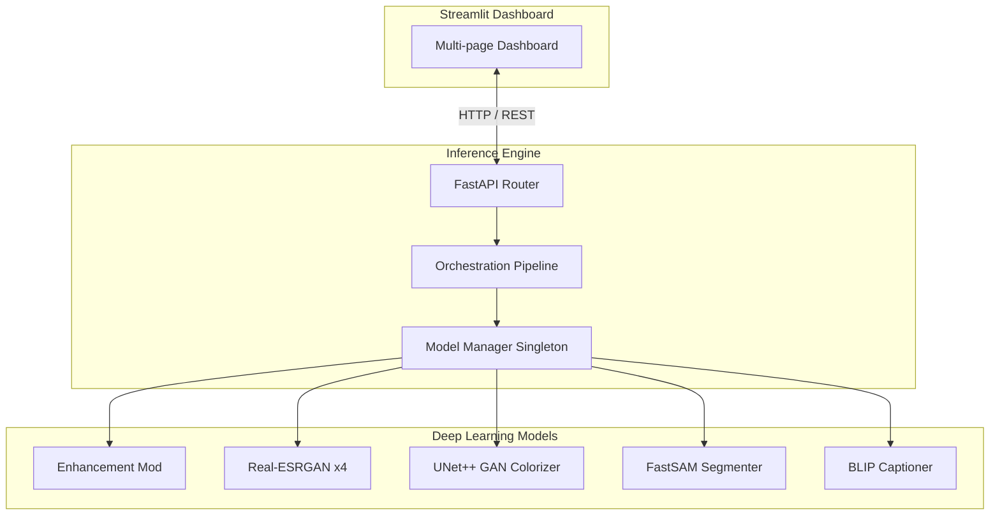
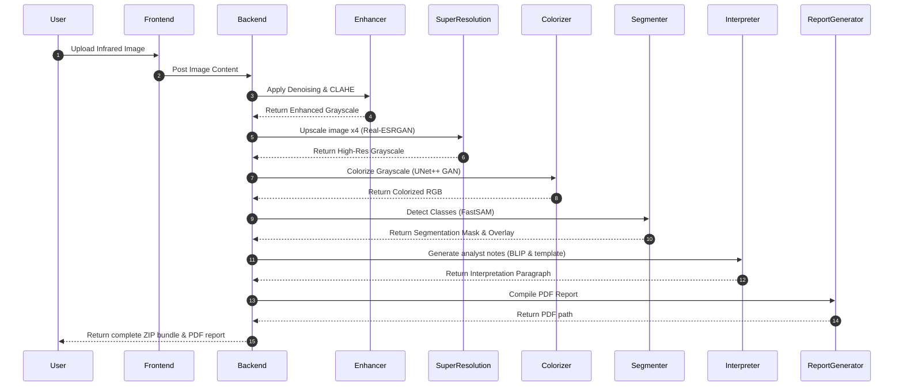
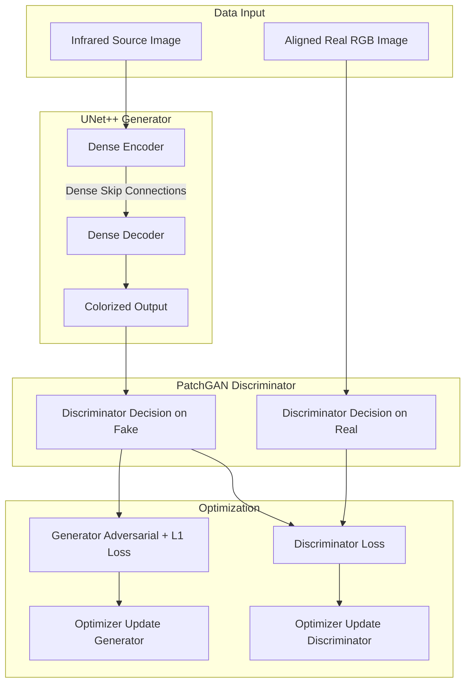

# System Architecture

This document describes the high-level architecture and pipeline workflows of **IRIS-AI**.

---

## 🏗️ High-Level System Architecture

IRIS-AI separates user interfaces from deep-learning backend workloads:

---

## 🔄 Inference Pipeline (Step-by-Step)

When an infrared image is submitted, it flows through the following sequential pipeline:

---

## 💾 Model Lifecycle Management

Preloading heavy models in deep learning scripts often causes duplicate GPU initialization overhead and crashes due to Out Of Memory (OOM) errors. 

To solve this, IRIS-AI implements a strict **Model Manager Singleton Pattern**:
- Configures lazy-loading of checkpoints.
- Tracks active memory.
- Safely moves weights between CPU and GPU/VRAM space when they are inactive.

---

## 🏋️ Training Flow (UNet++ GAN)

Below is the workflow showing how training data propagates through the generator and patch discriminator to update weight parameters:

